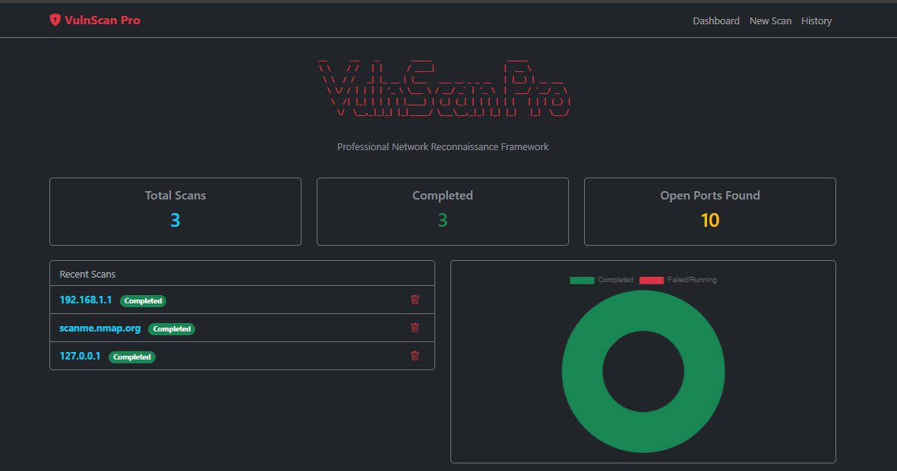
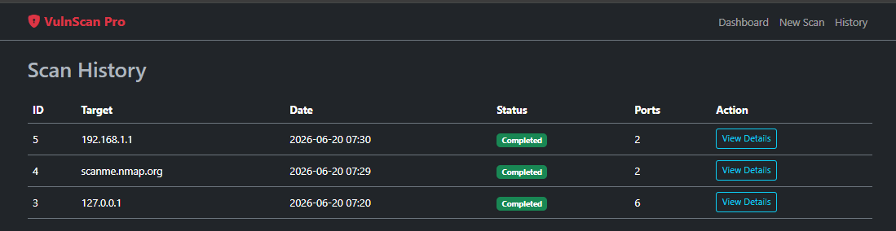
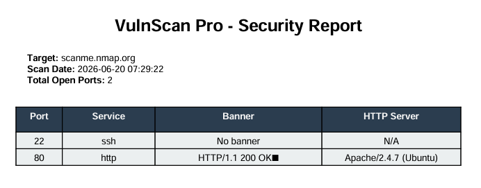

# 🛡️ VulnScan Pro

**VulnScan Pro** adalah framework *network reconnaissance* dan *vulnerability scanner* ringan yang dikembangkan dengan Python & Flask. Dibuat secara khusus untuk keperluan portofolio, edukasi keamanan siber, dan *legal pentesting*.

## 🚀 Fitur Utama
- **Fast Port Scanning:** Menggunakan multithreading (`ThreadPoolExecutor`).
- **Service & Banner Grabbing:** Identifikasi service dan banner extraction secara otomatis.
- **HTTP Analysis:** Mengekstrak *Server Headers* dan *Status Codes* dari target web.
- **Reporting Engine:** Ekspor hasil ke format CSV dan PDF.
- **Modern Dashboard:** UI berbasis Flask, Bootstrap 5 Dark Mode, dan Chart.js.
- **Background Tasks:** Memproses scan secara *asynchronous* dengan AJAX real-time updates.

## 🛠️ Arsitektur Proyek
- **Backend:** Flask, Flask-SQLAlchemy, Flask-Limiter
- **Scanner Core:** Pure Python `socket` & `requests` (Tidak bergantung pada Nmap binary)
- **Database:** SQLite3
- **Frontend:** HTML5, Bootstrap 5, Vanilla JS, Chart.js

## 📸 Pratinjau Aplikasi

### 🖥️ Dashboard Utama
Halaman dashboard menampilkan ringkasan statistik pemindaian jaringan, status *real-time* tugas pemindaian, serta grafik donat interaktif yang memetakan efisiensi hasil kerja.
![Dashboard VulnScan Pro]
<p align="center">
  
</p>

### ⏳ Riwayat Pemindaian (Scan History)
Fitur manajemen riwayat pemindaian yang memungkinkan pengguna memantau data lama, melacak jumlah port yang terbuka, serta menghapus log pemindaian secara dinamis.
![Scan History VulnScan Pro]
<p align="center">
  
</p>

### 📄 Ekspor Laporan PDF (Security Report)
Hasil cetak laporan otomatis dalam format PDF yang menyajikan detail *port scanning*, mendeteksi jenis *service*, melakukan *banner grabbing*, serta mengurai informasi web server secara taktis.
![PDF Report VulnScan Pro]
<p align="center">
  
</p>

## ⚙️ Cara Instalasi & Menjalankan

1. **Clone repository ini**
   ```bash
   git clone https://github.com/Nigizagar/VulnScan-Pro.git
   cd vulnscan-pro
